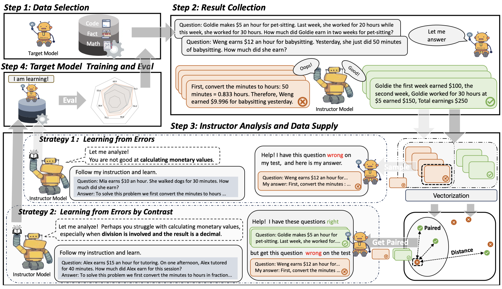

# LLMs-as-Instructors: Learning from Errors Toward Automating Model Improvement

This is the code repository for the paper "LLMs-as-Instructors: Learning from Errors Toward Automating Model Improvement"

## Overview

This paper introduces the innovative "LLMs-as-Instructors'' framework, which leverages the advanced Large Language Models (LLMs) to autonomously enhance the training of smaller target models. Inspired by the theory of "Learning from Errors'', this framework employs an instructor LLM to meticulously analyze the specific errors within a target model, facilitating targeted and efficient training cycles. Within this framework, we implement two strategies: "Learning from Error," which focuses solely on incorrect responses to tailor training data, and "Learning from Error by Contrast,'' which uses contrastive learning to analyze both correct and incorrect responses for a deeper understanding of errors. Our empirical studies, conducted with several open-source models, demonstrate significant improvements across multiple benchmarks, including mathematical reasoning, coding abilities, and factual knowledge. Notably, the refined Llama-3-8b-Instruction has outperformed ChatGPT, illustrating the effectiveness of our approach. By leveraging the strengths of both strategies, we have attained a more balanced performance improvement on both in-domain and out-of-domain benchmarks.



## Environment set up

- Python >= 3.8
- Pytorch == 2.1.0
- CUDA Version >= 11.8
- Install requirements:

```shell
conda create -n LaI python=3.9.19
conda activate LaI
pip install -r requirements.txt
```


## LLMs-as-Instructors

- First downloading the target model mistral at ``train/model/Mistral-7b-instrucion/``. Selecting the dataset to test the target model and run:

  ```shell
  python evaluation/get_performance_mmlu.py --model_name_or_path mistral --train Train
  python evaluation/get_performance_gsm8k.py --model_name_or_path mistral --train Train
  python evaluation/get_performance_mbpp.py --model_name_or_path mistral --train Train
  bash result/mbpp/run_mbpp.sh mistral
  ```

- Set up you api-key for deploying model GPT-4 as the instructors

  ```shell
  # Set the OpenAI API key as an environment variable
  export OPENAI_API_KEY='your_api_key_here'
  ```

  To use LLMs-as-Instructions to generate training data for model you can run ``LLMs_as_Instructors_LE.sh`` for strategy "Learning from Errors" or ``LLMs_as_Instructors_LEC.sh`` for strategy "Learning from Errors by Contrast": 

  ```shell
  # Strategy "Learning from Errors" 
  bash LLMs_as_Instructors_LE.sh 
  
  # Strategy "Learning from Errors by Contrast" 
  bash LLMs_as_Instructors_LEC.sh 
  ```

- Other optional arguments 

  ```shell
  optional arguments:
  
      --model            model specifies the model to use, default is 'mistral'
      
      --model_setting    raw model_setting sets the model configuration, default is 'raw'
      				
      --dataset          dataset defines which dataset to use, default is 'gsm8k' optional: mmlu, mbpp
      									 
      --sample_size      sample_size sets the number of samples to process, default is '3000'
      
       --k               the number nearest sample, default is 3
  ```

- After generation you can have post-processed training data by ``scripts/extract_training_samples.py``. To merge the data to    by running:

  ```shell
  python scripts/merge_training_data.py \
      --model mistral \
      --model_setting LaI_LEC_raw_k_2_train \
      --dataset_list gsm8k,mbpp,mmlu \
      --sample_size_list 3000,3000,3000 
  ```

## Training and Evaluation

- We recommend using scripts for training and then continuing to do evaluation.

  ```shell
  bash train.sh
  ```

- Or you can do the training and evaluation separately.

  For training run 

  ```shell
  lr=5e-6
  accu=8
  echo $lr
  echo $accu
  echo ----------------
     
  OUTPUT_PATH=LLMs_as_Instructors/mistral_${lr}_${accu}_iteration1/
  ZERO_STAGE=2
  echo $OUTPUT_PATH
  echo $ZERO_STAGE
  rm -rf output/
  mkdir -p $OUTPUT_PATH
  model_name_or_path=model/Mistral-7b-instrucion/AI-ModelScope/Mistral-7B-Instruct-v0.2
  
  deepspeed --include=localhost:0,1,2,3 --master_port 5020 train/code/main.py \
     --sft_only_data_path result/mistral_LaI_LEC_raw_k_2_train_9000.jsonl \
     --eval_data_file result/mistral_LaI_LEC_raw_k_2_train_9000.jsonl \
     --data_split 10,0,0 \
     --model_name_or_path ${model_name_or_path} \
     --per_device_train_batch_size 1 \
     --per_device_eval_batch_size 1 \
     --max_seq_len 512 \
     --learning_rate $lr \
     --weight_decay 0. \
     --num_train_epochs 1 \
     --gradient_accumulation_steps ${accu} \
     --lr_scheduler_type cosine \
     --num_warmup_steps 100 \
     --seed 1234 \
     --gradient_checkpointing \
     --zero_stage $ZERO_STAGE \
     --deepspeed \
     --output_dir $OUTPUT_PATH 
  ```

  For evaluation run the following command to get the evaluation result on the seven selected benchmarks:

  ```shell
  python evaluation/get_performance_mmlu.py 
  --model_name_or_path  train/code/LLMs_as_Instructors/mistral_${lr}_${accu}_iteration1/ 
  
  python evaluation/get_performance_gsm8k.py
  --model_name_or_path  train/code/LLMs_as_Instructors/mistral_${lr}_${accu}_iteration1/ 
  
  python evaluation/get_performance_mbpp.py 
  --model_name_or_path  train/code/LLMs_as_Instructors/mistral_${lr}_${accu}_iteration1/ 
  
  bash result/mbpp/run_mbpp.sh mistral_${lr}_${accu}_iteration1
  ```

  ## Citation

  If you find  LLMs-as-Instructors useful in your research, please consider citing:

  ```text
  @misc{ying2024llmsasinstructorslearningerrorsautomating,
        title={LLMs-as-Instructors: Learning from Errors Toward Automating Model Improvement}, 
        author={Jiahao Ying and Mingbao Lin and Yixin Cao and Wei Tang and Bo Wang and Qianru Sun and Xuanjing Huang and Shuicheng Yan},
        year={2024},
        eprint={2407.00497},
        archivePrefix={arXiv},
        primaryClass={cs.CL},
        url={https://arxiv.org/abs/2407.00497}, 
  }
  ```
  
  

